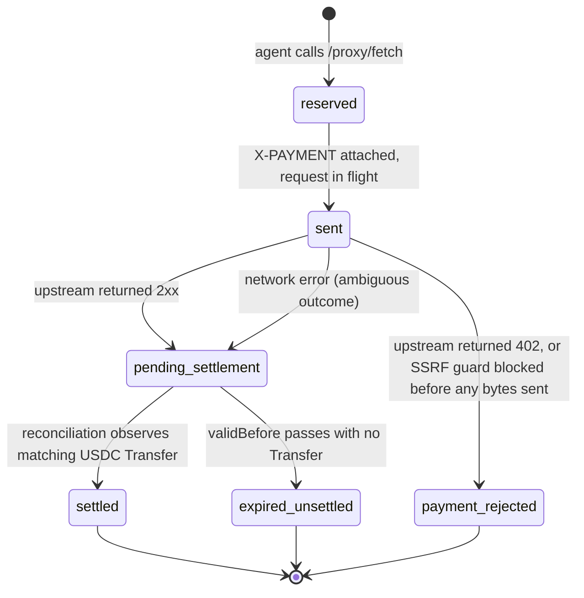

# x402 Credit Facilitator

Pay for any x402-enabled API with Floe credit. No pre-funding, no wallet management — delegate your collateral and the facilitator handles everything.

> You can also set up agents through the [Developer Dashboard](developer-dashboard.md) — a web UI at `dev-dashboard.floelabs.xyz`.

**Works with 13,000+ existing x402 APIs** on Base — no per-service integration needed.

## How It Works

```
Developer signs the auth header (off-chain)
    │
    ├── 1. Provision a Floe credit agent (one-time)
    │      → POST /v1/developer/agents creates a managed Privy wallet
    │      → Floe (the server) sends setOperator on-chain FROM that Privy
    │        wallet, scoping the facilitator to borrow against the agent's
    │        collateral up to borrowLimit, at rates ≤ maxRateBps, until expiry
    │      → POST /v1/developer/agents/:id/keys mints the agent's runtime
    │        `floe_*` API key (shown once)
    │
    ├── 2. Fund the agent's Privy wallet with USDC
    │      → Direct on-chain transfer, or buy via the dashboard's Coinbase
    │        on-ramp (credit card / bank). No bridge needed.
    │
    ├── 3. Open the credit line
    │      → POST /v1/developer/agents/:id/open-credit-line {depositRaw}
    │        (or `floe-agent open-credit-line --name <name> --deposit <usdc>`)
    │      → Floe server-signs registerBorrowIntent FROM the Privy wallet,
    │        posting a borrow intent against an open lender intent
    │      → Solver matches asynchronously; facility_loans row goes
    │        pending_on_chain → pending_match → active (a few seconds)
    │      → Borrowed USDC lands in the Privy wallet; creditIn now > 0
    │
    ├── 4. Call x402 APIs through the facilitator
    │      → Facilitator signs EIP-3009 transferWithAuthorization from the
    │        Privy wallet for each 402 response
    │      → The agent receives the API response; its credit is debited
    │
    └── 5. When done, wind the agent down
           → POST /v1/developer/agents/:id/close
           → Facilitator repays outstanding loans, returns collateral,
             transfers remaining USDC back to the developer
```

The **managed-agent pattern** is the abstraction boundary: you provision a Floe credit agent once, and the facilitator handles everything else on-chain. The developer's local wallet only signs API auth headers — Floe constructs and submits the on-chain operator delegation server-side from the agent's Privy wallet. The agent at runtime never signs intents, never manages loans, never touches EIP-3009. It just calls `fetch()` and the facilitator does the rest.

The on-chain primitives the facilitator relies on (all submitted server-side from the agent's Privy wallet):

- **`setOperator(operator, OperatorPermission)`** — Floe submits this at provisioning time to grant the facilitator scoped delegation.
- **`revokeOperator(operator)`** — submitted on agent close (or directly by the Privy wallet on any other revocation path).
- **`getOperatorPermission(agent, operator)`** — read by the facilitator before every borrow match to re-validate the constraints below.

The `OperatorPermission` struct (enforced by the `LendingIntentMatcher` contract at every match):

```solidity
struct OperatorPermission {
    bool    approved;                // revocable on-chain
    uint256 borrowLimit;             // max cumulative principal
    uint256 borrowed;                // running total of outstanding debt
    uint256 maxRateBps;              // ceiling on borrow rate
    uint256 expiry;                  // timestamp when permission expires
    address onBehalfOfRestriction;   // server sets this to the agent's Privy wallet
}
```

All five constraints are re-validated at the moment of each borrow match, so the facilitator provably cannot exceed them even if compromised.

## Reservation Lifecycle (RC-12)

Every paid call through `/proxy/fetch` creates a **reservation** that tracks the EIP-3009 authorization from the moment it is signed through final on-chain settlement. Reservations are the facilitator's double-charge defense: a single agent balance can be debited for an in-flight authorization at most once, and reconciliation closes out every reservation either as `settled` or as fully released.



| State | Balance reserved? | Agent action |
|---|---|---|
| `reserved` | yes | Waiting — no action |
| `sent` | yes | Waiting — no action |
| `pending_settlement` | yes | **Do not retry immediately.** Reconciliation runs every 15s; poll `GET /agents/:id/balance` (returns a `pendingSettlements` field) until the reservation finalizes. |
| `settled` | no (consumed) | Done — tx hash available via admin endpoints |
| `expired_unsettled` | no (released) | Safe to retry, possibly with a different provider |
| `payment_rejected` | no (released) | Safe to retry immediately — no payment was ever claimed |

### Ambiguous paid-request failure

When a network error occurs **after** the facilitator has attached the `X-PAYMENT` header to the upstream request, the reservation transitions to `pending_settlement` rather than `payment_rejected`. The merchant may already have called `transferWithAuthorization` on-chain even though our socket died before the response came back, so the outcome is not yet decidable. In this case `/proxy/fetch` returns HTTP 502 with:

```json
{
  "error": "upstream_paid_request_failed_ambiguous",
  "detail": "<network error message>",
  "reservation": {
    "nonce": "0x...",
    "validBefore": 1712513700
  }
}
```

Agents **must not retry immediately**. The reconciliation loop will finalize the reservation to `settled` (if a matching USDC `Transfer` is observed on-chain) or `expired_unsettled` (if `validBefore` passes with no transfer). Typical resolution latency is 15s–90s.

### Settlement deadline

The EIP-3009 authorization is signed with a `validBefore` timestamp set `X402_VALID_BEFORE_SECONDS` ahead of now (default `90`). If the facilitator receives a 2xx upstream response but `validBefore` has already passed, the merchant can no longer claim the authorization on-chain — so the reservation is released and `/proxy/fetch` returns HTTP 502 with:

```json
{
  "error": "upstream_payment_unsettled",
  "reservation": {
    "nonce": "0x...",
    "validBefore": 1712513700
  }
}
```

This is safe to retry immediately, ideally against a different provider that may respond faster.

### Why 502 and not 202

The facilitator made a paid upstream call and did not receive a confirmable settlement — this is a bad-gateway condition between the agent and a merchant the facilitator could not transact with cleanly, not a pending async response.

## Quick Start

### With AgentKit CLI (recommended)

The simplest way to register an agent and get an API key:

```bash
# TypeScript SDK
npx floe-agent register --name my-agent --borrow-limit 10000

# Python SDK
floe-agent register --name my-agent --borrow-limit 10000
```

The CLI signs a wallet auth message, calls `POST /v1/developer/agents` to provision a managed Privy wallet (with server-side `setOperator` delegation), mints a `floe_*` key via `POST /v1/developer/agents/:id/keys`, and stores the key in your OS keychain. The key is printed once.

### With AgentKit action (in-conversation)

If you want an LLM to register an agent during a chat session, the `grant_credit_delegation` action wraps the same two API calls:

```typescript
import { x402ActionProvider } from "floe-agent";

const agentkit = await AgentKit.from({
  walletProvider,
  actionProviders: [
    x402ActionProvider({ facilitatorUrl: "https://credit-api.floelabs.xyz" }),
  ],
});

const result = await agentkit.invoke("grant_credit_delegation", {
  name: "my-agent",
  facilitatorUrl: "https://credit-api.floelabs.xyz",
  borrowLimit: "10000",   // $10K max credit
  maxRateBps: "1500",     // 15% max interest rate
  expiryDays: "90",       // 90-day delegation
});
// → result includes the API key (stored in-memory for the session)

// Now fetch any x402 API
const data = await agentkit.invoke("x402_fetch", {
  url: "https://api.example.com/premium-data",
});
```

The action prints the key once and stores it in-memory for the rest of the session. For persistence, prefer the CLI above.

### With curl

```bash
# Step 1: Provision a managed agent. The server signs setOperator on-chain
# from the agent's Privy wallet — your local wallet only signs auth headers.
TIMESTAMP=$(date +%s)
MESSAGE="Floe Credit API
Timestamp: $TIMESTAMP"
SIGNATURE=$(cast wallet sign "$MESSAGE" --private-key $YOUR_DEVELOPER_PRIVKEY)

AGENT=$(curl -sS -X POST https://credit-api.floelabs.xyz/v1/developer/agents \
  -H "Content-Type: application/json" \
  -H "X-Wallet-Address: $YOUR_DEVELOPER_ADDRESS" \
  -H "X-Signature: $SIGNATURE" \
  -H "X-Timestamp: $TIMESTAMP" \
  -d '{
    "name": "my-agent",
    "borrowLimitRaw": "10000000000",
    "maxRateBps": 1500,
    "expirySeconds": 7776000
  }')
AGENT_ID=$(echo "$AGENT" | jq -r .agentId)

# Step 2: Mint an API key for the new agent. Re-sign auth headers — the
# 5-minute window may have rolled over.
TIMESTAMP=$(date +%s)
MESSAGE="Floe Credit API
Timestamp: $TIMESTAMP"
SIGNATURE=$(cast wallet sign "$MESSAGE" --private-key $YOUR_DEVELOPER_PRIVKEY)

curl -X POST "https://credit-api.floelabs.xyz/v1/developer/agents/$AGENT_ID/keys" \
  -H "Content-Type: application/json" \
  -H "X-Wallet-Address: $YOUR_DEVELOPER_ADDRESS" \
  -H "X-Signature: $SIGNATURE" \
  -H "X-Timestamp: $TIMESTAMP" \
  -d '{ "label": "production" }'
# → { "key": "floe_...", "id": 7, "keyPrefix": "...", ... }

# Step 3: Start making paid API calls with the returned agent key
curl -X POST https://credit-api.floelabs.xyz/v1/proxy/fetch \
  -H "Authorization: Bearer floe_YOUR_AGENT_KEY" \
  -H "Content-Type: application/json" \
  -d '{ "url": "https://api.example.com/data", "method": "GET" }'
```

### With Python

```python
from floe_agentkit_actions import x402_action_provider, X402Config

provider = x402_action_provider(X402Config(
    facilitator_url="https://credit-api.floelabs.xyz",
))
# Register with AgentKit — 6 x402 actions available
```

Or use the REST API directly:

```python
import requests

API_KEY = "floe_YOUR_API_KEY"
BASE = "https://credit-api.floelabs.xyz"
headers = { "Authorization": f"Bearer {API_KEY}", "Content-Type": "application/json" }

# Make a paid API call
resp = requests.post(f"{BASE}/v1/proxy/fetch", headers=headers, json={
    "url": "https://api.example.com/data",
    "method": "GET",
})
print(resp.json())  # Response from the target API
```

## Registration

Registration is a two-step API call, both authenticated with a wallet signature:

1. **Create the agent** (`POST /v1/developer/agents`) — Floe provisions a managed Privy wallet for the agent, then issues the on-chain `setOperator` delegation **from that Privy wallet** to the facilitator. You don't send any on-chain transactions from your local wallet. Body: `{ name, borrowLimitRaw, maxRateBps, expirySeconds }`. Returns `{ agentId, status, privyWalletAddress, delegationTxHash }`.
2. **Mint an API key** (`POST /v1/developer/agents/:agentId/keys`) — issues a `floe_*` key scoped to that agent. Optional body `{ label, permissions }`. The full key is returned **once**; only its prefix is persisted server-side. Each agent has a one-active-key cap — use `POST /keys/:keyId/rotate` to swap atomically.

Both calls accept any of three credentials interchangeably: a dashboard session cookie, a `floe_live_*` developer key, or a wallet-signature header set (`X-Wallet-Address` + `X-Signature` + `X-Timestamp`). The agentkit SDKs use the signature path so users don't need to obtain a developer key first.

### Wallet signature format

```text
Floe Credit API
Timestamp: {unix-seconds}
```

Signed with the developer's wallet via `personal_sign` / EIP-191. The middleware verifies the recovered signer matches `X-Wallet-Address` and rejects timestamps more than ±5 minutes from server time. EOA (ECDSA), deployed ERC-1271 smart wallets, and undeployed ERC-6492-wrapped smart wallets are all accepted.

### Managed Privy wallets

Each agent owns its own server-managed Privy wallet. The Privy wallet is the on-chain identity that holds collateral, takes facility loans, and pays merchants via the facilitator. The developer's wallet is only used to authenticate management calls — it never signs settlement or `setOperator` transactions.

This replaces the older two-step "pre-register → sign setOperator → register" dance. There is no `onBehalfOfRestriction` to set: the Privy wallet *is* the borrowing identity.

## AgentKit Actions

| Action | Type | Description |
|--------|------|-------------|
| `grant_credit_delegation` | Setup | One-shot: provisions a managed Privy wallet, delegates the facilitator server-side, mints an API key. Takes `name`, `borrowLimit`, `maxRateBps`, `expiryDays`. Prefer the `floe-agent register` CLI for persistent multi-agent setups. |
| `revoke_credit_delegation` | Teardown | Calls `revokeOperator` on-chain to revoke a facilitator delegation from your local wallet (legacy on-chain operation; not used for managed agents created via `grant_credit_delegation`). |
| `check_credit_delegation` | Read | Reads `getOperatorPermission` on-chain from your local wallet for the given operator (legacy on-chain operation). |
| `x402_fetch` | Proxy | Fetch any URL — auto-pays if 402, passthrough if free |
| `x402_get_balance` | Read | Credit status: limit, used, available, active loans |
| `x402_get_transactions` | Read | Payment history with pagination |

## REST API Reference

**Base URL:** `https://credit-api.floelabs.xyz`

### Public (No Auth)

#### GET /health

Liveness probe.

```bash
curl https://credit-api.floelabs.xyz/health
# → { "status": "ok" }
```

For agent registration endpoints (`POST /v1/developer/agents`, `POST /v1/developer/agents/:id/keys`, list/revoke/rotate/close), see [Credit API → Developer Agents](credit-api.md#developer-agents).

#### GET /v1/proxy/check

Check if a URL requires x402 payment (unauthenticated probe).

```bash
curl "https://credit-api.floelabs.xyz/v1/proxy/check?url=https://api.example.com/data"
```

### Authenticated (Bearer token)

#### POST /v1/proxy/fetch

Proxy a request. Handles x402 payments automatically.

```json
{
  "url": "https://api.example.com/data",
  "method": "GET",
  "headers": { "Accept": "application/json" },
  "body": "optional"
}
```

| Status | Meaning |
|--------|---------|
| 200 | Success — response from target |
| 400 | Invalid request or blocked URL |
| 401 | Invalid API key |
| 402 | Insufficient credit |
| 403 | Account frozen or closed |
| 429 | Rate limit exceeded — see body shape below |
| 502 | Target unreachable, or paid-request failure (see [Reservation Lifecycle](#reservation-lifecycle-rc-12)) |

A `429` response body looks like:

```json
{
  "error": "rate_limit_exceeded",
  "limit": 30,
  "retry_after_seconds": 7
}
```

The rate limit is 30 requests/minute per agent, enforced by a token bucket (`RC12_RATE_LIMIT_PER_MINUTE` env var, default `30`). The `retry_after_seconds` field tells the agent when the next token will be available.

#### GET /v1/agents/balance

```json
{
  "creditLimit": "10000000000",
  "creditUsed": "3200000000",
  "creditAvailable": "6800000000",
  "pendingSettlements": "50000000",
  "activeLoans": [{ "loanId": "42", "principalRaw": "5000000000" }],
  "delegationActive": true
}
```

**`pendingSettlements`** (RC-12): sum of reservations in `pending_settlement` state — authorizations that have been signed and sent but not yet confirmed on-chain by the reconciliation loop. This amount is temporarily reserved against the agent's credit limit until the reconciliation loop finalizes each reservation to `settled` or `expired_unsettled`. See [Reservation Lifecycle (RC-12)](#reservation-lifecycle-rc-12).

#### GET /v1/agents/transactions

Paginated payment history.

```json
{
  "transactions": [
    {
      "targetUrl": "https://api.example.com/data",
      "method": "GET",
      "paymentAmountRaw": "750000",
      "status": "success",
      "x402TxHash": "0x...",
      "createdAt": "2026-04-05T..."
    }
  ],
  "nextCursor": 41,
  "hasMore": true
}
```

#### POST /v1/agents/close

Initiate wind-down. Repays all loans, transfers remaining USDC to your wallet, closes account.

```json
{
  "status": "completed",
  "loansRepaid": 2,
  "loansRemaining": 0,
  "usdcTransferred": "1500000000"
}
```

## Credit Model

Your credit is backed by on-chain collateral (ETH or cbBTC) via Floe's lending protocol. The facilitator:

- **Borrows USDC** against your collateral when your payment wallet runs low
- **Monitors collateral health** and freezes spending before you're at risk
- **Rolls over loans** before they expire so your credit stays active
- **Repays everything** when you revoke delegation or close your account

You never manage loans directly. The facilitator handles the entire lifecycle.

### OperatorPermission parameters

For **managed agents** (created via `POST /v1/developer/agents` or the CLI), Floe constructs and submits `setOperator` server-side from the agent's Privy wallet — you never set these parameters directly. The values you choose at provisioning time map to the on-chain fields as follows:

| Provisioning input | On-chain field | Notes |
|---|---|---|
| `borrowLimitRaw` (`POST /v1/developer/agents`) / `--borrow-limit` (CLI) | `borrowLimit` (uint256) | Raw USDC, 6 decimals. CLI flag is in USDC for convenience. |
| `maxRateBps` | `maxRateBps` (uint256) | Interest rate ceiling in basis points (e.g. `1500` = 15% APR). |
| `expirySeconds` / `--expiry-days` | `expiry` (uint256) | Server adds `expirySeconds` to `now` before submitting. |
| _(server-managed)_ | `operator` (address) | The facilitator's operator EOA. |
| _(server-managed)_ | `onBehalfOfRestriction` (address) | Set to the agent's own Privy wallet by the server. There is nothing for the caller to pass here. |

All five fields are enforced on-chain by the `LendingIntentMatcher` contract at every borrow match — the facilitator cannot exceed any of them. Because the Privy wallet IS the on-chain borrowing identity, there is no separate `onBehalfOfRestriction` for the caller to manage.

### Revoking delegation

To wind an agent down, use:

- **REST**: `POST /v1/developer/agents/:agentId/close` — server triggers a full wind-down: repays all outstanding facility loans, transfers any remaining USDC from the agent's Privy wallet back to the developer, and marks the agent `closed`. This is the **only** path that actually retires the operator permission and frees up the agent slot.
- **On-chain** (advanced): the legacy `revokeOperator(operator)` action remains available for callers that hold an EOA-issued operator permission outside the managed flow.

> `floe-agent revoke <name>` is **not** a wind-down. It only revokes the agent's API key (server-side + local keychain entry) — the on-chain operator permission, active loans, and the Privy wallet's USDC balance are untouched. Use it to rotate credentials, not to retire an agent.

The facilitator can no longer register new borrow intents once the operator permission is revoked, and any in-flight intents fail match-time revalidation. Existing active loans remain callable for repay/rollover by the facilitator (intentional — protects against agent-side griefing that would trap an operator mid-loan).

### What Happens If Collateral Drops

The facilitator monitors the agent's collateral-to-debt ratio. If it drops too low, new spending is paused until the price recovers or the agent receives more collateral. Active loans are unaffected — they continue to maturity and can be rolled over.

To stop entirely, call `POST /v1/developer/agents/:agentId/close`. The facilitator repays loans, the agent's collateral returns, and remaining USDC is transferred to the developer.
