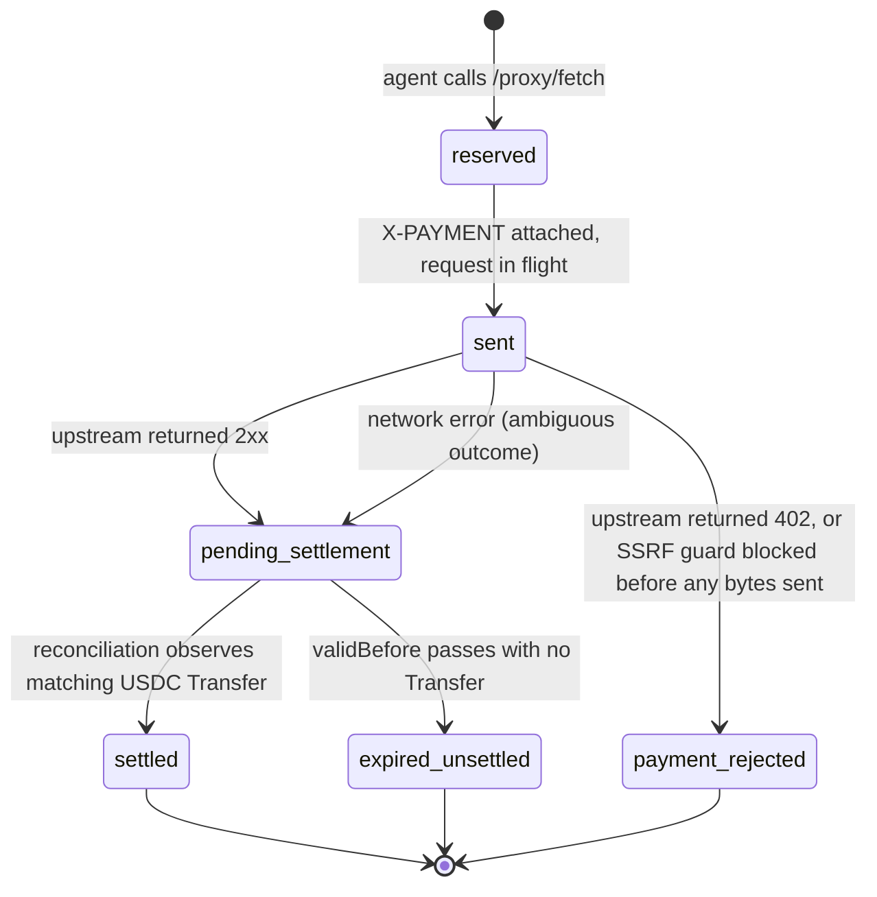

# Pay any vendor API

Floe is the spend layer: one key pays every vendor per call, governed by server-side spend controls. Fund an agent's balance once, and Floe pays each vendor per call from that balance — handling signing, settlement, and verification for you.

> You can also set up agents through the [Developer Dashboard](developer-dashboard.md) — a web UI at `dev-dashboard.floelabs.xyz`.

**Reaches thousands of vendor API services** — no per-service integration needed.

## How payment works

Your agent has a prepaid dollar balance. When it calls a vendor API through the proxy:

1. The proxy forwards the request to the vendor.
2. If the vendor requires payment, the facilitator pays it from your agent's balance and re-sends the request.
3. Your agent receives the vendor's response; its balance is debited by the exact per-call cost.

Every call is checked against your spend controls first, and paid only if the vendor charges. Free endpoints pass through with no charge. Your agent never signs a payment or manages a wallet — it just calls `fetch()`.

Under the hood, payment settles in USDC on Base using the [x402 payment protocol](https://github.com/x402-foundation/x402) and EIP-3009 signatures. You never touch any of that.

## Protocol versions

The facilitator speaks both **x402 v1** and **x402 v2**. Version is negotiated per request by inspecting the 402 response your target API returned — you do not select a version yourself.

| Aspect | v1 | v2 |
|---|---|---|
| `PAYMENT-REQUIRED` header value | base64 of a single `PaymentRequirement`, or an array of them | base64 of a `{ x402Version: 2, accepts: [...], resource?, error?, extensions? }` envelope |
| Amount field name (on the wire) | `maxAmountRequired` | `amount` |
| Network identifier | short name (`"base"`) or CAIP-2 (`"eip155:8453"`) | CAIP-2 only (`"eip155:8453"`) |
| Outbound payment header | `X-PAYMENT` | `PAYMENT-SIGNATURE` |
| Settlement response header | `X-PAYMENT-RESPONSE` (free-form value) | `PAYMENT-RESPONSE` (base64 of `SettlementResponse`) |
| EIP-3009 typed data | identical | identical |

What this means for you:

- If your target API is a `@x402/hono` (v2) server, the facilitator parses its envelope, picks the Base + USDC offer from `accepts`, and writes a v2 `PAYMENT-SIGNATURE` request.
- If your target API still emits a v1 bare requirement, the facilitator handles that path with `X-PAYMENT` exactly as before.
- The `GET /v1/proxy/check` probe surfaces the negotiated version as an `x402Version` field in its JSON response so you can sanity-check upstream behavior.

The facilitator only accepts offers with `scheme: "exact"` on Base mainnet (`network: "base"` or `"eip155:8453"`) paid in USDC. Other schemes and networks are filtered out before payment is attempted.

Spec references: [x402 v2 specification](https://github.com/x402-foundation/x402/blob/main/specs/x402-specification-v2.md), [v2 HTTP transport](https://github.com/x402-foundation/x402/blob/main/specs/transports-v2/http.md), [CDP migration guide](https://docs.cdp.coinbase.com/x402/migration-guide).

## The managed-agent flow

> **This is managed plumbing — what Floe does for you.** You fund an agent and call the proxy. Floe provisions the wallet and pays each vendor from the agent's balance automatically.

```text
Developer signs the auth header (off-chain)
    │
    ├── 1. Provision an agent (one-time)
    │      → POST /v1/developer/agents creates a managed wallet
    │      → POST /v1/developer/agents/:id/keys mints the agent's runtime
    │        `floe_*` API key (shown once)
    │
    ├── 2. Fund the agent's balance
    │      → Buy via the dashboard (card / Apple Pay / Google Pay / bank),
    │        or send a direct transfer. No bridge needed.
    │
    ├── 3. Call vendor APIs through the facilitator
    │      → The agent calls POST /v1/proxy/fetch with its floe_* key
    │      → If the vendor charges, the facilitator pays it from the agent's
    │        balance and returns the response; the balance is debited
    │
    └── 4. When done, close the agent
           → POST /v1/developer/agents/:id/close
           → Remaining balance is transferred back to the developer
```

The **managed-agent pattern** is the abstraction boundary: you provision an agent once and fund it, and the facilitator handles every payment. The developer's local wallet only signs API auth headers. The agent at runtime never signs anything and never touches settlement — it just calls `fetch()` and the facilitator does the rest.

## Reservation Lifecycle (RC-12)

Every paid call through `/proxy/fetch` creates a **reservation** that tracks the EIP-3009 authorization from the moment it is signed through final on-chain settlement. Reservations are the facilitator's double-charge defense: a single agent balance can be debited for an in-flight authorization at most once, and reconciliation closes out every reservation either as `settled` or as fully released.



| State | Balance reserved? | Agent action |
|---|---|---|
| `reserved` | yes | Waiting — no action |
| `sent` | yes | Waiting — no action |
| `pending_settlement` | yes | **Do not retry immediately.** Reconciliation runs every 15s; poll `GET /agents/:id/balance` (returns a `pendingSettlements` field) until the reservation finalizes. |
| `settled` | no (consumed) | Done — tx hash available via admin endpoints |
| `expired_unsettled` | no (released) | Safe to retry, possibly with a different provider |
| `payment_rejected` | no (released) | Safe to retry immediately — no payment was ever claimed |

### Ambiguous paid-request failure

When a network error occurs **after** the facilitator has attached the `X-PAYMENT` header to the upstream request, the reservation transitions to `pending_settlement` rather than `payment_rejected`. The merchant may already have called `transferWithAuthorization` on-chain even though our socket died before the response came back, so the outcome is not yet decidable. In this case `/proxy/fetch` returns HTTP 502 with:

```json
{
  "error": "upstream_paid_request_failed_ambiguous",
  "detail": "<network error message>",
  "reservation": {
    "nonce": "0x...",
    "validBefore": 1712513700
  }
}
```

Agents **must not retry immediately**. The reconciliation loop will finalize the reservation to `settled` (if a matching USDC `Transfer` is observed on-chain) or `expired_unsettled` (if `validBefore` passes with no transfer). Typical resolution latency is 15s–90s.

### Settlement deadline

The EIP-3009 authorization is signed with a `validBefore` timestamp set `X402_VALID_BEFORE_SECONDS` ahead of now (default `90`). If the facilitator receives a 2xx upstream response but `validBefore` has already passed, the merchant can no longer claim the authorization on-chain — so the reservation is released and `/proxy/fetch` returns HTTP 502 with:

```json
{
  "error": "upstream_payment_unsettled",
  "reservation": {
    "nonce": "0x...",
    "validBefore": 1712513700
  }
}
```

This is safe to retry immediately, ideally against a different provider that may respond faster.

### Why 502 and not 202

The facilitator made a paid upstream call and did not receive a confirmable settlement — this is a bad-gateway condition between the agent and a merchant the facilitator could not transact with cleanly, not a pending async response.

## Quick Start

### With AgentKit CLI (recommended)

The simplest way to register an agent and get an API key:

```bash
# TypeScript SDK
npx floe-agent register --name my-agent

# Python SDK
floe-agent register --name my-agent
```

The CLI signs a wallet auth message, calls `POST /v1/developer/agents` to provision a managed wallet, mints a `floe_*` key via `POST /v1/developer/agents/:id/keys`, and stores the key in your OS keychain. The key is printed once.

### With AgentKit action (in-conversation)

If you want an LLM to register an agent during a chat session, the `grant_credit_delegation` action wraps the same two API calls:

```typescript
import { x402ActionProvider } from "floe-agent";

const agentkit = await AgentKit.from({
  walletProvider,
  actionProviders: [
    x402ActionProvider({ facilitatorUrl: "https://credit-api.floelabs.xyz" }),
  ],
});

const result = await agentkit.invoke("grant_credit_delegation", {
  name: "my-agent",
  expiryDays: "90",       // 90-day agent lifetime
});
// → result includes the API key (stored in-memory for the session)

// Now pay any vendor API
const data = await agentkit.invoke("x402_fetch", {
  url: "https://api.example.com/premium-data",
});
```

The action prints the key once and stores it in-memory for the rest of the session. For persistence, prefer the CLI above.

### With curl

The flow uses two different credentials:

1. A **developer key** (`floe_live_*`) for management calls — provisioning an agent and minting its runtime key. You get a developer key from the [Developer Dashboard](developer-dashboard.md) (**API Keys** page). This is the simplest path and what we recommend for backend services.
2. An **agent key** (`floe_*`) for the runtime call — paid API requests through `/proxy/fetch`. Minted by the management call above.

```bash
# Set FLOE_LIVE_KEY to the floe_live_* developer key you created from the
# dashboard's API Keys page. Treat it like any other secret credential.
export FLOE_LIVE_KEY="floe_live_…"

# Step 1: Provision a managed agent. Auth: floe_live_* developer key.
# Omitting borrowLimitRaw creates a wallet-funded, pay-as-you-go agent that
# spends from its prepaid balance.
AGENT=$(curl -sS -X POST https://credit-api.floelabs.xyz/v1/developer/agents \
  -H "Authorization: Bearer $FLOE_LIVE_KEY" \
  -H "Content-Type: application/json" \
  -d '{
    "name": "my-agent",
    "maxRateBps": 1500,
    "expirySeconds": 7776000
  }')
AGENT_ID=$(echo "$AGENT" | jq -r .agentId)

# Step 2: Mint a runtime key for the agent.
curl -X POST "https://credit-api.floelabs.xyz/v1/developer/agents/$AGENT_ID/keys" \
  -H "Authorization: Bearer $FLOE_LIVE_KEY" \
  -H "Content-Type: application/json" \
  -d '{ "label": "production" }'
# → { "key": "floe_...", "id": 7, "keyPrefix": "...", ... }

# Step 3: Make paid API calls with the returned agent key.
# Runtime calls authenticate as the agent, not the developer.
curl -X POST https://credit-api.floelabs.xyz/v1/proxy/fetch \
  -H "Authorization: Bearer floe_YOUR_AGENT_KEY" \
  -H "Content-Type: application/json" \
  -d '{ "url": "https://api.example.com/data", "method": "GET" }'
```

<details>
<summary><strong>Alternative: wallet-signature auth (no developer key needed)</strong></summary>

If you don't want to mint a developer key first, every management endpoint also accepts a wallet signature on each request. This is the path the agentkit CLIs use. It requires you to sign an EIP-191 message with your wallet's private key — for backend scripting that usually means `cast wallet sign` (Foundry) or an equivalent.

```bash
TIMESTAMP=$(date +%s)
MESSAGE="Floe Credit API
Timestamp: $TIMESTAMP"
SIGNATURE=$(cast wallet sign "$MESSAGE" --private-key $YOUR_DEVELOPER_PRIVKEY)

curl -sS -X POST https://credit-api.floelabs.xyz/v1/developer/agents \
  -H "Content-Type: application/json" \
  -H "X-Wallet-Address: $YOUR_DEVELOPER_ADDRESS" \
  -H "X-Signature: $SIGNATURE" \
  -H "X-Timestamp: $TIMESTAMP" \
  -d '{ "name": "my-agent", "maxRateBps": 1500, "expirySeconds": 7776000 }'
```

Signatures are valid for ±5 minutes, so a long-running backend has to re-sign per request. The developer-key path above is simpler unless you're already managing wallet signing.

</details>

### With Python

```python
from floe_agentkit_actions import x402_action_provider, X402Config

provider = x402_action_provider(X402Config(
    facilitator_url="https://credit-api.floelabs.xyz",
))
# Register with AgentKit — 24 x402 actions available
```

Or use the REST API directly. `API_KEY` here is the agent's `floe_*` runtime key (not the `floe_live_*` developer key):

```python
import requests

API_KEY = "floe_YOUR_AGENT_KEY"  # the floe_* runtime key minted in Step 2
BASE = "https://credit-api.floelabs.xyz"
headers = { "Authorization": f"Bearer {API_KEY}", "Content-Type": "application/json" }

# Make a paid API call
resp = requests.post(f"{BASE}/v1/proxy/fetch", headers=headers, json={
    "url": "https://api.example.com/data",
    "method": "GET",
})
print(resp.json())  # Response from the target API
```

## Registration

Registration is a two-step API call, both authenticated with a wallet signature:

1. **Create the agent** (`POST /v1/developer/agents`) — Floe provisions a managed wallet for the agent. You don't send any on-chain transactions from your local wallet. Body: `{ name, maxRateBps, expirySeconds }`. Returns `{ agentId, status, privyWalletAddress }`.
2. **Mint an API key** (`POST /v1/developer/agents/:agentId/keys`) — issues a `floe_*` key scoped to that agent. Optional body `{ label, permissions }`. The full key is returned **once**; only its prefix is persisted server-side. Each agent may hold up to **5** active keys (default `MAX_KEYS_PER_AGENT`); minting past the cap returns `409`. Rotate a key atomically with `POST /v1/developer/agents/:agentId/keys/:keyId/rotate`.

Both calls accept any of three credentials interchangeably: a dashboard session cookie, a `floe_live_*` developer key, or a wallet-signature header set (`X-Wallet-Address` + `X-Signature` + `X-Timestamp`). The agentkit SDKs use the signature path so users don't need to obtain a developer key first.

### Wallet signature format

```text
Floe Credit API
Timestamp: {unix-seconds}
```

Signed with the developer's wallet via `personal_sign` / EIP-191. The middleware verifies the recovered signer matches `X-Wallet-Address` and rejects timestamps more than ±5 minutes from server time. EOA (ECDSA), deployed ERC-1271 smart wallets, and undeployed ERC-6492-wrapped smart wallets are all accepted.

### Managed wallets

Each agent owns its own server-managed wallet, which holds the agent's balance and pays vendors via the facilitator. The developer's wallet is only used to authenticate management calls — it never signs settlements.

## AgentKit Actions

| Action | Type | Description |
|--------|------|-------------|
| `grant_credit_delegation` | Setup | One-shot: provisions a managed agent wallet and mints an API key. Takes `name` and `expiryDays`. Prefer the `floe-agent register` CLI for persistent multi-agent setups. |
| `revoke_credit_delegation` | Teardown | Legacy teardown for agents provisioned outside the managed flow. Not needed for managed agents created via `grant_credit_delegation`. |
| `check_credit_delegation` | Read | Legacy read for agents provisioned outside the managed flow. |
| `x402_fetch` | Proxy | Pay any vendor URL — pays if the vendor charges, passthrough if free |
| `x402_get_balance` | Read | Spendable balance and pending settlements |
| `x402_get_transactions` | Read | Payment history with pagination |

## REST API Reference

**Base URL:** `https://credit-api.floelabs.xyz`

### Public (No Auth)

#### GET /v1/health

Liveness probe.

```bash
curl https://credit-api.floelabs.xyz/v1/health
# → { "status": "ok" }
```

For agent registration endpoints (`POST /v1/developer/agents`, `POST /v1/developer/agents/:id/keys`, list/revoke/rotate/close), see [Credit API → Developer Agents](credit-api.md#developer-agents).

#### GET /v1/proxy/check

Check if a URL requires x402 payment (unauthenticated probe). Sends a live GET request to the target — returns cost info only if the server responds with HTTP 402 and a valid `PAYMENT-REQUIRED` header.

**Limitation:** Some x402 APIs only return 402 on POST requests or behind authentication. For these, the probe will return `x402: false` even though the endpoint does charge. The `estimate_x402_cost` AgentKit action has the same behavior — it probes live, there is no static pricing catalog.

```bash
curl "https://credit-api.floelabs.xyz/v1/proxy/check?url=https://api.example.com/data"
```

On a 402 response with a parseable `PAYMENT-REQUIRED` header, the body is:

```json
{
  "x402": true,
  "status": 402,
  "x402Version": 2,
  "payment": {
    "amount": "10000",
    "asset": "0x833589fCD6eDb6E08f4c7C32D4f71b54bdA02913",
    "payTo": "0x209693Bc6afc0C5328bA36FaF03C514EF312287C",
    "network": "eip155:8453"
  }
}
```

`x402Version` is `1` or `2` depending on which envelope shape the merchant returned. If the header can't be parsed, the response is `502` with `code` set to one of `invalid_base64`, `invalid_json`, or `no_compatible_requirement` so you can tell whether the upstream is misformatting the header or offering a payment scheme/network Floe doesn't support.

### Authenticated (Bearer token)

#### POST /v1/proxy/fetch

Proxy a request. Pays the vendor automatically when payment is required.

```json
{
  "url": "https://api.example.com/data",
  "method": "GET",
  "headers": { "Accept": "application/json" },
  "body": "optional"
}
```

**Request headers**

| Header | Required | Purpose |
|--------|----------|---------|
| `Authorization: Bearer floe_…` | yes | Agent API key |
| `Content-Type: application/json` | yes | — |
| `Idempotency-Key: <opaque>` | no | Stripe-style retry-safe key (≤255 chars). Same key + same agent within 10 min replays the cached response instead of paying again. See [Idempotency](#idempotency) below. |

**Response headers (success)**

| Header | Always set | Purpose |
|--------|------------|---------|
| `X-Floe-Cost-USDC` | every 2xx | Raw USDC units (6-decimal integer string) actually charged for this call. Set by the facilitator after a successful x402 settlement; `0` on free passthrough responses. |
| `X-Floe-Payment-Amount` | on 2xx paid responses | Human-readable decimal USDC amount (e.g. `0.005000`), derived from `X-Floe-Cost-USDC` (raw units ÷ 10⁶). Intended for display only. |
| `X-Floe-Idempotent-Replay: true` | on replays only | Indicates the response body is a cached replay of a prior request with the same `Idempotency-Key`. Absent on the first attempt and on requests without a key. |

> **Note on upstream headers:** The proxy forwards most response headers from the upstream API. Some providers (e.g. Venice) include their own balance headers like `X-Balance-Remaining`. These reflect the **facilitator's balance with that provider**, not your agent's Floe balance. Always use `X-Floe-Cost-USDC` or `GET /v1/agents/balance` for your agent's actual spend and balance state.

| Status | Meaning |
|--------|---------|
| 200 | Success — response from target |
| 400 | Invalid request or blocked URL |
| 401 | Invalid API key |
| 402 | `Insufficient balance` — top up the agent's balance |
| 402 | `spend_limit_exceeded` — the call was rejected by a server-side spend control |
| 403 | Account frozen or closed |
| 409 | `Idempotency-Key` is currently in-flight on another request — see [Idempotency](#idempotency) |
| 429 | Rate limit exceeded — see body shape below |
| 502 | Target unreachable, or paid-request failure (see [Reservation Lifecycle](#reservation-lifecycle-rc-12)) |

A `429` response body looks like:

```json
{
  "error": "rate_limit_exceeded",
  "reason": "agent_proxy_limit",
  "retry_after_seconds": 7,
  "limit_per_minute": 3000,
  "remaining": 0
}
```

`reason` distinguishes the three rate-limit sources so an agent can decide whether to wait, slow down, or fall back to a free path:

| `reason` | Source | Agent action |
|----------|--------|--------------|
| `agent_proxy_limit` | Per-agent token bucket (default 3,000/min, `RC12_RATE_LIMIT_PER_MINUTE`). The standard `/proxy/fetch` ceiling — anti-DoS-sized, since every call settles against your own balance. Raised per account on request. | Wait `retry_after_seconds`; safe to retry. |
| `ip_rate_limit` | Per-IP sliding window (covers `/proxy/check` and `/x402/estimate`). | Wait, or check if the IP is shared with other callers. |
| `global_rate_limit` | Server-wide protection on the `/v1/*` surface. | Wait longer — may indicate platform overload. |

`limit_per_minute` echoes the per-bucket cap; `remaining` is the number of tokens left in the current window (always `0` on rejection).

### Idempotency

`POST /v1/proxy/fetch` accepts a Stripe-style `Idempotency-Key` request header to make retries safe across network failures. Without it, a retry after a transient 502 or socket error can trigger a second upstream payment.

**Rules**

1. Send `Idempotency-Key: <opaque-key>` (any string up to 255 chars — typically a UUIDv4) along with your `Authorization` header.
2. Within a 10-minute window, **the same key from the same agent** replays the original response byte-for-byte (status + headers + body) plus `X-Floe-Idempotent-Replay: true`.
3. If a previous request with that key is still **in flight**, a concurrent retry receives `409 Conflict` with `{ "error": "request_in_flight", "idempotency_key": "<key>" }`. Wait and retry, or generate a fresh key.
4. Requests **without** the header skip idempotency entirely (backward-compatible).
5. Keys are scoped per-agent — two agents may share a key without colliding.
6. Replays do **not** consume rate-limit tokens and do **not** trigger a second upstream call.

```bash
curl -X POST https://credit-api.floelabs.xyz/v1/proxy/fetch \
  -H "Authorization: Bearer floe_YOUR_AGENT_KEY" \
  -H "Content-Type: application/json" \
  -H "Idempotency-Key: $(uuidgen)" \
  -d '{ "url": "https://api.example.com/data", "method": "GET" }'
```

Stripe's contract applies: the response body is cached regardless of status (2xx, 4xx, 5xx), so a retry against the same key returns the same answer — generate a **new key** for a logically new attempt.

#### GET /v1/agents/balance

```json
{
  "spendableRaw": "6800000000",
  "pendingSettlements": "50000000"
}
```

**`spendableRaw`**: the agent's prepaid balance available to spend right now, in raw USDC (6 decimals). This is what your agent can pay with on its next call.

**`pendingSettlements`** (RC-12): sum of reservations in `pending_settlement` state — authorizations that have been signed and sent but not yet confirmed on-chain by the reconciliation loop. This amount is temporarily reserved against the agent's balance until the reconciliation loop finalizes each reservation to `settled` or `expired_unsettled`. See [Reservation Lifecycle (RC-12)](#reservation-lifecycle-rc-12).

#### GET /v1/agents/transactions

Paginated payment history.

```json
{
  "transactions": [
    {
      "targetUrl": "https://api.example.com/data",
      "method": "GET",
      "paymentAmountRaw": "750000",
      "status": "success",
      "x402TxHash": "0x...",
      "createdAt": "2026-04-05T..."
    }
  ],
  "nextCursor": 41,
  "hasMore": true
}
```

#### POST /v1/developer/agents/:agentId/close

Close the agent. Returns the remaining balance to the developer and closes the account.

```json
{
  "status": "completed",
  "usdcTransferred": "1500000000"
}
```

## Balance & spend controls

Each agent spends from its own prepaid balance. You fund the agent (from the dashboard or a direct transfer), and the facilitator pays each vendor per call from that balance. When the balance runs out, calls that require payment stop until you top it up. There is no credit line and nothing for your agent to manage — it just calls the proxy.

Every paid call is governed by server-side spend controls before any money moves:

- **Spend limits** — per-key and per-session caps so an agent can't overspend, even in a loop.
- **Allowed destinations** — restrict an agent to a list of vendor endpoints.
- **Value-aware caps** — reject a call whose cost exceeds a per-call ceiling.

Controls are enforced by the facilitator on every request. A call is paid only if it passes them and the vendor actually charges.

### Closing an agent

To retire an agent, use `POST /v1/developer/agents/:agentId/close` — the server transfers any remaining balance back to the developer and marks the agent `closed`. This is the path that frees up the agent slot.

> `floe-agent revoke <name>` is **not** a close. It only revokes the agent's API key (server-side + local keychain entry) — the agent's balance is untouched. Use it to rotate credentials, not to retire an agent.
