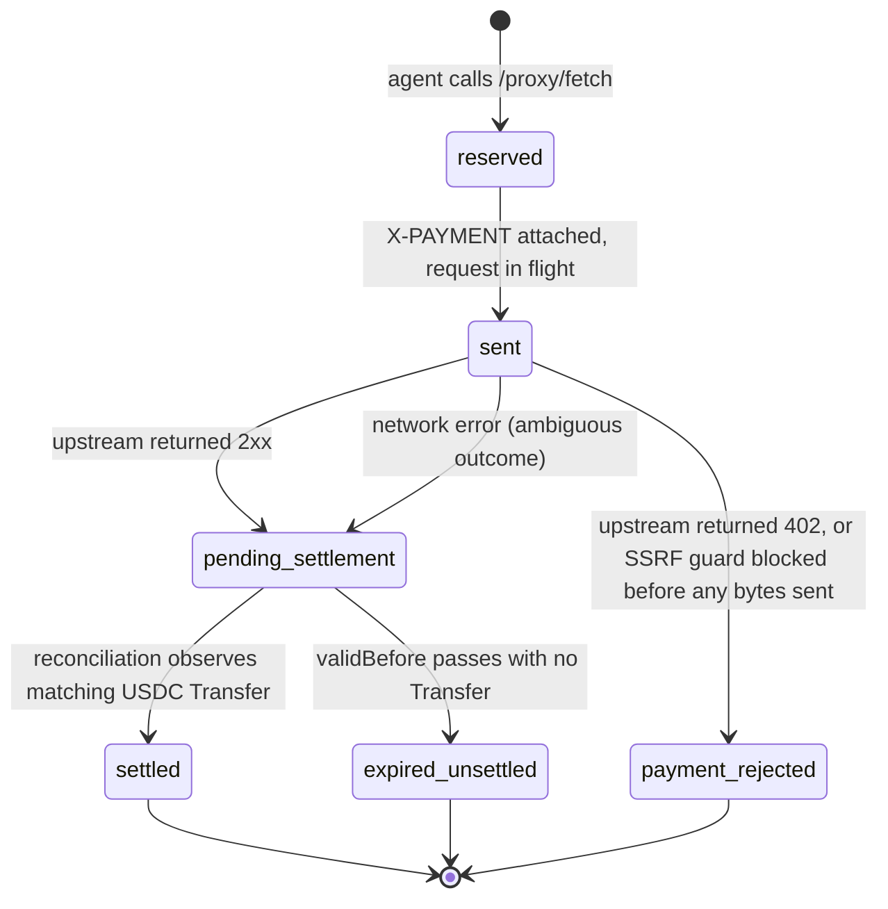

# x402 Credit Facilitator

Pay for any x402-enabled API with Floe credit. No pre-funding, no wallet management — delegate your collateral and the facilitator handles everything.

**Works with 13,000+ existing x402 APIs** on Base — no per-service integration needed.

## How It Works

```
Agent has ETH/cbBTC collateral
    │
    ├── 1. Grant the facilitator an OperatorPermission (one-time, on-chain)
    │      → Your EOA calls setOperator(facilitator, { borrowLimit, maxRateBps,
    │        expiry, onBehalfOfRestriction }) on the LendingIntentMatcher
    │      → Facilitator is now scoped to borrow USDC against your collateral
    │        up to borrowLimit, at rates ≤ maxRateBps, until expiry
    │
    ├── 2. Call x402 APIs through the facilitator
    │      → Facilitator auto-borrows USDC on-demand against your collateral
    │      → Signs EIP-3009 transferWithAuthorization for each 402 response
    │      → You get the API response; your credit is debited
    │
    └── 3. When done, revoke the operator permission
           → Facilitator winds down: repays all outstanding loans,
             returns collateral, transfers remaining USDC to your wallet
```

The **operator pattern** is the abstraction boundary: you grant a scoped on-chain permission once, and the facilitator handles everything else. You never sign intents, never manage loans, never touch EIP-3009. Your agent never thinks about money infrastructure — it just calls `fetch()` and the facilitator does the rest.

The on-chain primitives are:
- **`setOperator(operator, OperatorPermission)`** — grants scoped delegation
- **`revokeOperator(operator)`** — immediate revocation
- **`getOperatorPermission(agent, operator)`** — view current permission state

The `OperatorPermission` struct (enforced by the `LendingIntentMatcher` contract at every match):

```solidity
struct OperatorPermission {
    bool    approved;                // revocable on-chain
    uint256 borrowLimit;             // max cumulative principal
    uint256 borrowed;                // running total of outstanding debt
    uint256 maxRateBps;              // ceiling on borrow rate
    uint256 expiry;                  // timestamp when permission expires
    address onBehalfOfRestriction;   // if set, operator must route USDC here
}
```

All five constraints are re-validated at the moment of each borrow match, so the facilitator provably cannot exceed them even if compromised.

## Reservation Lifecycle (RC-12)

Every paid call through `/proxy/fetch` creates a **reservation** that tracks the EIP-3009 authorization from the moment it is signed through final on-chain settlement. Reservations are the facilitator's double-charge defense: a single agent balance can be debited for an in-flight authorization at most once, and reconciliation closes out every reservation either as `settled` or as fully released.



| State | Balance reserved? | Agent action |
|---|---|---|
| `reserved` | yes | Waiting — no action |
| `sent` | yes | Waiting — no action |
| `pending_settlement` | yes | **Do not retry immediately.** Reconciliation runs every 15s; poll `GET /agents/:id/balance` (returns a `pendingSettlements` field) until the reservation finalizes. |
| `settled` | no (consumed) | Done — tx hash available via admin endpoints |
| `expired_unsettled` | no (released) | Safe to retry, possibly with a different provider |
| `payment_rejected` | no (released) | Safe to retry immediately — no payment was ever claimed |

### Ambiguous paid-request failure

When a network error occurs **after** the facilitator has attached the `X-PAYMENT` header to the upstream request, the reservation transitions to `pending_settlement` rather than `payment_rejected`. The merchant may already have called `transferWithAuthorization` on-chain even though our socket died before the response came back, so the outcome is not yet decidable. In this case `/proxy/fetch` returns HTTP 502 with:

```json
{
  "error": "upstream_paid_request_failed_ambiguous",
  "detail": "<network error message>",
  "reservation": {
    "nonce": "0x...",
    "validBefore": 1712513700
  }
}
```

Agents **must not retry immediately**. The reconciliation loop will finalize the reservation to `settled` (if a matching USDC `Transfer` is observed on-chain) or `expired_unsettled` (if `validBefore` passes with no transfer). Typical resolution latency is 15s–90s.

### Settlement deadline

The EIP-3009 authorization is signed with a `validBefore` timestamp set `X402_VALID_BEFORE_SECONDS` ahead of now (default `90`). If the facilitator receives a 2xx upstream response but `validBefore` has already passed, the merchant can no longer claim the authorization on-chain — so the reservation is released and `/proxy/fetch` returns HTTP 502 with:

```json
{
  "error": "upstream_payment_unsettled",
  "reservation": {
    "nonce": "0x...",
    "validBefore": 1712513700
  }
}
```

This is safe to retry immediately, ideally against a different provider that may respond faster.

### Why 502 and not 202

The facilitator made a paid upstream call and did not receive a confirmable settlement — this is a bad-gateway condition between the agent and a merchant the facilitator could not transact with cleanly, not a pending async response.

## Quick Start

### With AgentKit (recommended)

```typescript
import { x402ActionProvider } from "@floe/agentkit-actions";

const agentkit = await AgentKit.from({
  walletProvider,
  actionProviders: [
    x402ActionProvider({ facilitatorUrl: "https://x402.floelabs.xyz" }),
  ],
});

// One action: creates wallet, sets delegation, approves collateral, registers
const result = await agentkit.invoke("grant_credit_delegation", {
  facilitatorAddress: "0x...",  // provided by the facilitator
  facilitatorUrl: "https://x402.floelabs.xyz",
  borrowLimit: "10000",         // $10K max credit
  maxRateBps: "1500",           // 15% max interest rate
  expiryDays: "90",             // 90-day delegation
  collateralToken: "0x4200000000000000000000000000000000000006", // WETH
});
// → result.apiKey, result.creditLimit, result.privyWalletAddress

// Now fetch any x402 API
const data = await agentkit.invoke("x402_fetch", {
  url: "https://api.example.com/premium-data",
});
```

### With curl

The two-step registration flow (see [Registration](#registration) below for the full protocol):

```bash
# Step 1: Pre-register — creates your custodial Privy payment wallet
# The nonce can be any unique string; messages are signed per-registration.
NONCE="$(date +%s)-$(openssl rand -hex 8)"
MESSAGE="Register with Floe Facilitator
Nonce: $NONCE"
SIGNATURE=$(cast wallet sign "$MESSAGE" --private-key $YOUR_AGENT_PRIVKEY)

curl -X POST https://x402.floelabs.xyz/agents/pre-register \
  -H "Content-Type: application/json" \
  -d "{\"walletAddress\": \"$YOUR_AGENT_ADDRESS\", \"signature\": \"$SIGNATURE\", \"nonce\": \"$NONCE\"}"
# → { "privyWalletAddress": "0x..." }

# Step 2: Call setOperator on-chain to grant the facilitator delegation.
# Use the returned privyWalletAddress as the onBehalfOfRestriction.
# (See the "Granting delegation on-chain" section below for the exact tx.)

# Step 3: Complete registration — facilitator verifies the on-chain
# operator permission exists and returns your API key
NONCE2="$(date +%s)-$(openssl rand -hex 8)"
MESSAGE2="Register with Floe Facilitator
Nonce: $NONCE2"
SIGNATURE2=$(cast wallet sign "$MESSAGE2" --private-key $YOUR_AGENT_PRIVKEY)

curl -X POST https://x402.floelabs.xyz/agents/register \
  -H "Content-Type: application/json" \
  -d "{\"walletAddress\": \"$YOUR_AGENT_ADDRESS\", \"signature\": \"$SIGNATURE2\", \"nonce\": \"$NONCE2\"}"
# → { "apiKey": "floe_...", "privyWalletAddress": "0x...", "creditLimit": "10000000000" }

# Step 4: Start making paid API calls with your returned API key
curl -X POST https://x402.floelabs.xyz/proxy/fetch \
  -H "Authorization: Bearer floe_YOUR_API_KEY" \
  -H "Content-Type: application/json" \
  -d '{ "url": "https://api.example.com/data", "method": "GET" }'
```

### With Python

```python
from floe_agentkit_actions import x402_action_provider, X402Config

provider = x402_action_provider(X402Config(
    facilitator_url="https://x402.floelabs.xyz",
))
# Register with AgentKit — 6 x402 actions available
```

Or use the REST API directly:

```python
import requests

API_KEY = "floe_YOUR_API_KEY"
BASE = "https://x402.floelabs.xyz"
headers = { "Authorization": f"Bearer {API_KEY}", "Content-Type": "application/json" }

# Make a paid API call
resp = requests.post(f"{BASE}/proxy/fetch", headers=headers, json={
    "url": "https://api.example.com/data",
    "method": "GET",
})
print(resp.json())  # Response from the target API
```

## Registration

Registration is a three-step process:

1. **Pre-register** (`POST /agents/pre-register`) — creates your custodial Privy payment wallet. Request body: `{ walletAddress, signature, nonce }` where `signature` is an EIP-191 signature of the message `Register with Floe Facilitator\nNonce: {nonce}`. Nonces are one-time-use and enforced across facilitator restarts via a persistent SQLite table.
2. **Grant operator delegation on-chain** — your EOA calls `setOperator` on the `LendingIntentMatcher` contract (`0x17946cD3e180f82e632805e5549EC913330Bb175`) with the facilitator's operator address and the `OperatorPermission` struct. Use the `privyWalletAddress` returned from step 1 as the `onBehalfOfRestriction` — this binds the facilitator's borrowing to settle USDC into *your* custodial wallet, not an attacker-controlled address.
3. **Complete registration** (`POST /agents/register`) — facilitator reads `getOperatorPermission(agent, facilitator)` on-chain to verify the delegation is active, then activates your account and returns your API key. Request body has the same shape as pre-register (`walletAddress`, `signature`, `nonce`) with a fresh nonce.

With AgentKit, the `grant_credit_delegation` action handles all three steps behind one call — it pre-registers, signs the EIP-191 messages, sends the on-chain `setOperator` transaction (and a collateral approval), then completes registration. Your agent never sees the underlying protocol.

### EIP-191 signature format

```
Register with Floe Facilitator
Nonce: {your-unique-nonce}
```

Signed with your agent's EOA private key via `personal_sign` / EIP-191. The facilitator verifies the recovered signer matches the `walletAddress` in the request body. Nonces are rejected on reuse (replay protection) and expire after 24 hours.

### Granting delegation on-chain

Between pre-register and register, you must send the on-chain transaction that creates the `OperatorPermission`. Using `ethers`:

```typescript
import { ethers } from "ethers";

const matcher = new ethers.Contract(
  "0x17946cD3e180f82e632805e5549EC913330Bb175",
  ["function setOperator(address operator, uint256 borrowLimit, uint256 maxRateBps, uint256 expiry, address onBehalfOfRestriction) external"],
  agentSigner
);

const FACILITATOR_OPERATOR = "0x..."; // from the facilitator operator
const privyWallet = "0x..."; // from the pre-register response

await matcher.setOperator(
  FACILITATOR_OPERATOR,
  ethers.parseUnits("10000", 6),          // borrowLimit: 10k USDC
  1500,                                    // maxRateBps: 15%
  Math.floor(Date.now() / 1000) + 90 * 86400, // expiry: 90 days
  privyWallet,                             // onBehalfOfRestriction: YOUR Privy wallet
);
```

You'll also need to approve the matcher to pull your collateral token (WETH or cbBTC). See the AgentKit `grant_credit_delegation` source or the [`credit-api`](credit-api.md) reference for the full sequence.

## AgentKit Actions

| Action | Type | Description |
|--------|------|-------------|
| `grant_credit_delegation` | Setup | One-time: creates wallet, sets operator delegation, approves collateral, registers |
| `revoke_credit_delegation` | Teardown | Revokes delegation — triggers wind-down (loans repaid, collateral returned) |
| `check_credit_delegation` | Read | Check delegation status: borrowed vs limit, rate cap, expiry |
| `x402_fetch` | Proxy | Fetch any URL — auto-pays if 402, passthrough if free |
| `x402_get_balance` | Read | Credit status: limit, used, available, active loans |
| `x402_get_transactions` | Read | Payment history with pagination |

## REST API Reference

**Base URL:** `https://x402.floelabs.xyz`

### Public (No Auth)

#### GET /health

Liveness probe.

```bash
curl https://x402.floelabs.xyz/health
# → { "status": "ok" }
```

#### POST /agents/pre-register

Step 1 of registration. Creates your custodial Privy payment wallet and returns its address.

```json
{
  "walletAddress": "0xYourAgentEOA",
  "signature": "0x...",
  "nonce": "unique-string-per-registration"
}
```

Signature: EIP-191 signed message `Register with Floe Facilitator\nNonce: {nonce}`. Nonces are single-use (replay-protected in SQLite, 24h TTL).

Response:
```json
{ "privyWalletAddress": "0x..." }
```

Errors: `400` invalid request, `401` signature verification failed, `409` agent already registered (idempotent retry returns the existing Privy wallet via a GET, not this POST), `429` nonce reused — body:

```json
{ "error": "nonce_reused", "detail": "Nonce has already been consumed" }
```

**Note**: this is distinct from the global `rate_limit_exceeded` 429 on `/proxy/fetch`. Switch on the `error` field, not the status code. `nonce_reused` is not retryable with the same nonce — call `/agents/pre-register` again to mint a fresh one.

#### POST /agents/register

Step 3 of registration (step 2 is your on-chain `setOperator` call — not an HTTP endpoint). Verifies the on-chain operator permission, activates your account, and returns your API key.

Same request shape as `/agents/pre-register` (EIP-191 signed, fresh nonce required).

Response:
```json
{
  "apiKey": "floe_...",
  "privyWalletAddress": "0x...",
  "creditLimit": "10000000000"
}
```

Errors: `400` invalid request, `401` signature failed, `403` on-chain operator permission not found or not yet confirmed, `409` already registered.

#### GET /proxy/check

Check if a URL requires x402 payment (unauthenticated probe).

```bash
curl "https://x402.floelabs.xyz/proxy/check?url=https://api.example.com/data"
```

### Authenticated (Bearer token)

#### POST /proxy/fetch

Proxy a request. Handles x402 payments automatically.

```json
{
  "url": "https://api.example.com/data",
  "method": "GET",
  "headers": { "Accept": "application/json" },
  "body": "optional"
}
```

| Status | Meaning |
|--------|---------|
| 200 | Success — response from target |
| 400 | Invalid request or blocked URL |
| 401 | Invalid API key |
| 402 | Insufficient credit |
| 403 | Account frozen or closed |
| 429 | Rate limit exceeded — see body shape below |
| 502 | Target unreachable, or paid-request failure (see [Reservation Lifecycle](#reservation-lifecycle-rc-12)) |

A `429` response body looks like:

```json
{
  "error": "rate_limit_exceeded",
  "limit": 30,
  "retry_after_seconds": 7
}
```

The rate limit is 30 requests/minute per agent, enforced by a token bucket (`RC12_RATE_LIMIT_PER_MINUTE` env var, default `30`). The `retry_after_seconds` field tells the agent when the next token will be available.

#### GET /agents/balance

```json
{
  "creditLimit": "10000000000",
  "creditUsed": "3200000000",
  "creditAvailable": "6800000000",
  "pendingSettlements": "50000000",
  "activeLoans": [{ "loanId": "42", "principalRaw": "5000000000" }],
  "delegationActive": true
}
```

**`pendingSettlements`** (RC-12): sum of reservations in `pending_settlement` state — authorizations that have been signed and sent but not yet confirmed on-chain by the reconciliation loop. This amount is temporarily reserved against the agent's credit limit until the reconciliation loop finalizes each reservation to `settled` or `expired_unsettled`. See [Reservation Lifecycle (RC-12)](#reservation-lifecycle-rc-12).

#### GET /agents/transactions

Paginated payment history.

```json
{
  "transactions": [
    {
      "targetUrl": "https://api.example.com/data",
      "method": "GET",
      "paymentAmountRaw": "750000",
      "status": "success",
      "x402TxHash": "0x...",
      "createdAt": "2026-04-05T..."
    }
  ],
  "nextCursor": 41,
  "hasMore": true
}
```

#### POST /agents/close

Initiate wind-down. Repays all loans, transfers remaining USDC to your wallet, closes account.

```json
{
  "status": "completed",
  "loansRepaid": 2,
  "loansRemaining": 0,
  "usdcTransferred": "1500000000"
}
```

## Credit Model

Your credit is backed by on-chain collateral (ETH or cbBTC) via Floe's lending protocol. The facilitator:

- **Borrows USDC** against your collateral when your payment wallet runs low
- **Monitors collateral health** and freezes spending before you're at risk
- **Rolls over loans** before they expire so your credit stays active
- **Repays everything** when you revoke delegation or close your account

You never manage loans directly. The facilitator handles the entire lifecycle.

### OperatorPermission parameters

When granting delegation via `setOperator`, you provide these five fields. All are enforced on-chain by the `LendingIntentMatcher` contract at every borrow match — the facilitator cannot exceed any of them.

| Parameter | Type | Description |
|---|---|---|
| `operator` | `address` | The facilitator's operator EOA (provided by the facilitator) |
| `borrowLimit` | `uint256` | Max cumulative principal the facilitator may have outstanding (raw USDC units, 6 decimals) |
| `maxRateBps` | `uint256` | Interest rate ceiling in basis points (e.g. `1500` = 15% APR). Match reverts if a lend intent offers a higher rate. |
| `expiry` | `uint256` | Unix timestamp after which the permission is invalid. Match reverts after this time. |
| `onBehalfOfRestriction` | `address` | If non-zero, operator-initiated borrow intents must route the USDC to exactly this address. **Set this to your Privy wallet** (returned from pre-register) to bind facilitator borrowing to your custodial wallet. |

Additionally, you must **approve the collateral token** (WETH or cbBTC) for the matcher contract so the facilitator can pull collateral at match time. The AgentKit `grant_credit_delegation` action handles this with an unlimited approval by default (`args.collateralApproval` can override with a bounded amount for users who want tighter exposure control).

### Revoking delegation

Call `revokeOperator(operator)` on the matcher to immediately flip `approved` to `false`. The facilitator can no longer register new borrow intents, and any in-flight intents fail match-time revalidation. Your existing active loans remain callable for repay/rollover by the facilitator (intentional — protects against agent-side griefing that would trap an operator mid-loan).

Alternatively, `POST /agents/close` triggers a full wind-down: the facilitator repays all outstanding loans, transfers any remaining USDC from your Privy wallet to your agent address, and closes the account.

### What Happens If Collateral Drops

The facilitator monitors your collateral-to-debt ratio. If it drops too low, new spending is paused until the price recovers or you add collateral. Active loans are unaffected — they continue to maturity and can be rolled over.

If you want to stop entirely, call `revoke_credit_delegation` or `POST /agents/close`. The facilitator repays loans, your collateral returns, and remaining USDC is transferred to your wallet.
