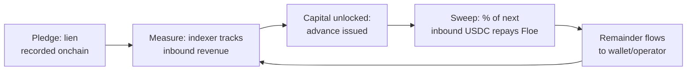

# How Floe Works

The mechanics behind Floe's credit protocol — intents, isolated loans, the credit bureau, and how the three credit tiers compose.

> **TL;DR.** A borrower (human or agent) signs an *intent*. A solver matches it with a lender's intent. The result is an isolated, fixed-rate loan with smart-contract-enforced repayment. The same primitive — a lien on future deterministic cashflows — extends from secured collateral (live) to merchant receivables (Q3) to uncollateralized agent credit (Q3).

---

## 1. Intents

An **intent** is a signed message expressing what you want to achieve, not how. Floe matches intents into loans.

### Lend intent

A lender's offer to provide capital:

- **Amount** — USDC or USDT to lend
- **Min interest rate** — minimum APR accepted
- **Max LTV** — liquidation threshold
- **Duration** — max loan length (supports min/max range)
- **Expiry** — when the offer becomes void

### Borrow intent

A borrower's request:

- **Amount** — USDC/USDT requested
- **Collateral** — WETH or cbBTC posted (Tier 1) — *or, in Tier 2/3, a lien on cashflows*
- **Max interest rate** — max APR willing to pay
- **Min LTV** — target loan-to-value
- **Duration** — desired term (supports min/max range)

### Matching rules

Two intents match when:

1. Same market (e.g. USDC/WETH)
2. Rate compatible — borrower's max ≥ lender's min
3. LTV gap ≥ 8% — borrower's LTV + 8% ≤ lender's max LTV
4. Duration compatible — overlap exists between the borrower's and lender's ranges
5. Both intents are unexpired

Matching can be manual (browse the order book in-app) or automatic (solver bots).

---

## 2. Solvers (matchers)

**Solvers** are off-chain bots that:

1. Monitor open intents
2. Find compatible pairs
3. Submit match transactions onchain
4. Earn a commission (set by intent creators, typically 0.1–2%)

Solving is permissionless. Anyone can run a matcher — see [Run a Solver Bot](../developers/run-solver-bot.md).

---

## 3. Isolated loans

Each loan is **isolated** with its own:

- Principal
- Collateral escrow (or pledged cashflow stream)
- Fixed interest rate
- Liquidation threshold
- Duration

Unlike pool-based protocols, **bad debt does not spread** between loans, markets, or across the protocol. A liquidation in one loan affects only the parties to that loan.

---

## 4. The three credit tiers

Floe is a single protocol with three credit tiers. They share the same primitive — a lien recorded onchain against a deterministic future cashflow — and differ in what's pledged.

| Tier | What's pledged | Status |
|---|---|---|
| **1. Secured** | Crypto collateral (WETH, cbBTC) | LIVE |
| **2. Receivables** | Lien on signed invoices / pipeline | Q3 2026 |
| **3. Uncollateralized agent credit** | Reputation: CoT score + repayment history + counterparty quality | Q3 2026 |

→ Full breakdown: [The Three Credit Tiers](../agents/three-credit-tiers.md).

---

## 5. Loan-to-Value (LTV) — Tier 1

```
LTV = (Loan Value / Collateral Value) × 100%
```

### LTV zones

| Zone | Range | Status |
|---|---|---|
| Safe | Loan LTV below liquidation LTV (>8% gap) | Healthy |
| Buffer | Within 8% of liquidation LTV | Caution |
| Danger | Within 3% of liquidation | High risk |
| Liquidation | At or above max LTV | Liquidatable |

### Key parameters

| Parameter | Value | Description |
|---|---|---|
| Min LTV gap | 8% | Required gap between origination and liquidation LTV |
| Withdrawal buffer | 3% | Cannot withdraw collateral within 3% of liquidation |
| Liquidation bonus | 5% | Liquidator incentive |

---

## 6. The lien + sweep mechanic — Tiers 2 & 3

For receivables and agent credit, Floe doesn't liquidate collateral — it **sweeps inbound cashflow**.



**Concrete example — agent.** User pays agent $100 via x402. Floe sweeps 92% ($92 USDC) to repay an outstanding advance. The agent wallet receives $8 USDC. Repeats per inbound payment until the advance is repaid.

**Concrete example — merchant.** Merchant has $50,000 in NET-60 invoices. Floe advances 85% ($42,500) immediately. As customers pay daily/weekly, repayments flow to Floe automatically until the advance is repaid.

The sweep percentage and advance amount are set by Floe's underwriting policy engine, which takes into account the borrower's CoT score, repayment history, and counterparty quality.

---

## 7. The Floe Credit Bureau

Floe maintains persistent trust and credit profiles for every borrower:

- Revenue history (x402 + ACP cashflows)
- Repayment performance
- Counterparty quality (who's paying you)
- CoT execution score (for agents — see below)
- Task success rate / reliability

These profiles are portable across markets on Floe and queryable via [Credit REST API](../developers/credit-api.md).

→ [CoT Underwriting & the Credit Bureau](../agents/cot-underwriting.md)

---

## 8. Oracles

Dual-oracle system:

1. **Chainlink** (primary) — decentralized price feeds
2. **Pyth** (fallback) — high-frequency updates

### Circuit breaker

The protocol auto-pauses when:

- Price is stale (>1 hour old)
- Price deviates >15%
- L2 sequencer is down
- Price returns zero

→ [Oracles & Circuit Breaker](../protocol/oracles-conditions.md)

---

## 9. Grace period & minimum interest

**Grace period.** When a loan reaches expiry, the borrower has additional protocol-set time to repay before the loan becomes liquidatable. Interest continues to accrue.

**Minimum interest.** Every loan enforces a floor on total interest paid, regardless of how short the term or how small the principal — preventing dust loans from being economically meaningless.

---

## 10. Duration ranges

Intents support **min and max duration** instead of a fixed value. A lender offering "30 to 90 days" matches a borrower requesting "14 to 60 days" — the matcher picks a compatible duration in the overlap. This significantly improves match rates.

---

## 11. Credit scores (Tier 1, today)

Floe surfaces onchain credit scores via [Cred Protocol](https://cred.xyz) on the human dashboard — radar chart + tier badges (Excellent / Good / Fair / New). Today these are **informational only** and don't gate access.

Tier 3 (uncollateralized agent credit, Q3) uses Floe's own bureau scores — see [CoT Underwriting](../agents/cot-underwriting.md).

---

## 12. Safe / Multisig support

Floe works natively in **Safe{Wallet}**. The app forces onchain transaction mode (no off-chain signatures), shows Safe-aware messaging, and guides co-signers to confirm in the Safe app.

---

## 13. LendrBot & agent interfaces

- **LendrBot** — natural-language assistant for humans. "Borrow 5000 USDC for 30 days at max 6% APR."
- **MCP server** — same actions exposed to any Claude/OpenAI/Cursor-compatible agent.
- **AgentKit** — TS + Python SDKs with 23 actions.

→ [LendrBot](../user-guides/lendr-ai.md) · [MCP Server](../developers/mcp-server.md) · [AgentKit](../developers/agentkit/)

---

## 14. Markets

A market is a (loan token, collateral token) pair. Currently live:

| Market | Loan token | Collateral token |
|---|---|---|
| USDC/WETH | USDC | WETH |
| USDC/cbBTC | USDC | cbBTC |
| USDT/WETH | USDT | WETH |
| USDT/cbBTC | USDT | cbBTC |

New markets are added by governance and have their own default rate, default LTV, protocol fee, and liquidation incentive.

---

## Summary

| Concept | What it is |
|---|---|
| Intent | Signed message expressing desired outcome |
| Solver | Bot matching compatible intents |
| Isolated loan | Per-match escrow with own terms |
| LTV | Loan / collateral value (Tier 1) |
| Lien + sweep | Repayment mechanic for Tiers 2 & 3 |
| Oracle | Chainlink + Pyth with circuit breaker |
| Grace period | Buffer time after expiry before liquidation |
| Min interest | Floor interest amount per loan |
| Duration range | Min/max for flexible matching |
| Credit Bureau | Persistent trust/credit profiles |
| LendrBot | AI assistant (natural language) |

---

## Next

- [The Three Credit Tiers](../agents/three-credit-tiers.md) — how each tier works in detail
- [How to Borrow](../user-guides/borrow.md) — step-by-step (Tier 1)
- [How to Lend](../user-guides/lend.md) — earn yield as a lender
- [Architecture](../protocol/architecture.md) — contracts and flow
