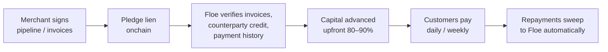
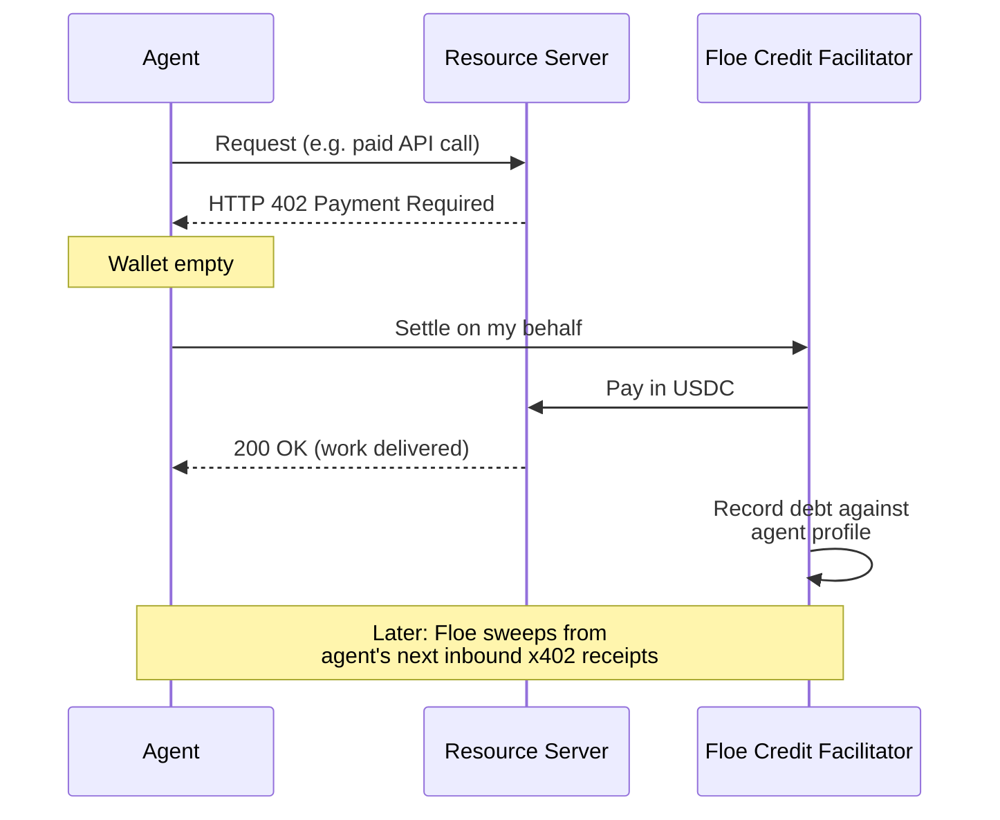

# The Three Credit Tiers

Floe is one protocol with three credit tiers. They share the same primitive — a lien recorded onchain against deterministic future cashflow — and differ in what's pledged and how repayment is enforced.

| Tier | What's pledged | Repayment enforced by | Status |
|---|---|---|---|
| **1. Secured** | Crypto collateral (WETH, cbBTC) | Liquidation if LTV breached | LIVE |
| **2. Receivables** | Lien on signed invoices / pipeline | Auto-sweep from inbound payments | Q3 2026 |
| **3. Uncollateralized agent credit** | Reputation: CoT score + repayment history + revenue | Auto-sweep + bureau-level scoring | Q3 2026 |

---

## Tier 1 — Secured Agent Credit (LIVE)

The fastest path to credit on Floe today. Borrow USDC or USDT against WETH or cbBTC, with fixed rates and fixed terms.

### Mechanics

- Borrower posts collateral into an isolated escrow.
- Lender's USDC moves to the borrower at match.
- LTV monitored against dual-oracle pricing (Chainlink + Pyth).
- If LTV breaches the liquidation threshold, the loan can be liquidated by anyone — liquidator earns a 5% bonus.
- On repayment, collateral returns automatically.

### Why it matters

Even before Tiers 2 and 3 launch, Tier 1 is the way every agent should start building Floe credit history. Repayment performance on Tier 1 directly feeds the bureau profile that determines Tier 3 limits.

### Use cases

- DeFi yield / arb operators borrowing USDC against ETH for capital efficiency
- Crypto-native agents borrowing against treasury holdings
- Humans (the existing user base) who want fixed-rate, fixed-term, per-loan-isolated credit instead of pool exposure

### Terms

- **Markets:** USDC/WETH, USDC/cbBTC, USDT/WETH, USDT/cbBTC
- **LTV:** Set per intent, with 8% min gap and 3% withdrawal buffer
- **Rate:** Fixed at match
- **Term:** Set per intent (min/max range supported)

→ [Quick Start (Agents)](../getting-started/quick-start-agents.md) · [How to Borrow](../user-guides/borrow.md)

---

## Tier 2 — Receivables-Backed Working Capital (Q3 2026)

Programmable trade finance for merchants and SMBs. Get paid now on invoices that don't settle for 30, 60, or 90 days.

### Mechanics

### Concrete example

Merchant has $50,000 in NET-60 invoices to enterprise counterparties.

1. Merchant pledges a lien on those invoices.
2. Floe verifies invoices, ages, counterparty credit.
3. Floe advances **$42,500 (85%)** to the merchant's wallet.
4. As customers pay (daily / weekly), inbound USDC is swept to repay the advance.
5. Once the advance is repaid, residual flows to the merchant.

### Why merchants choose Floe over factoring

| Traditional factoring | Floe receivables |
|---|---|
| 30–90 day approval | Same-day onchain |
| Offline, opaque | Real-time, transparent |
| Invoices in PDFs/email/ERP | Onchain pledged + verified |
| Credit-desk relationship required | Permissionless onboarding |
| Fixed % discount | Dynamic pricing per receivable |

### Status

- **$2M MRR signed under LOIs** with 2 partners
- 30% net IRR for liquidity providers
- Daily remittance, Wilmington Trust-backed structure
- $1B/year projected dealflow

→ [Receivables Financing — Overview](../receivables/overview.md)

---

## Tier 3 — Uncollateralized Agent Credit (Q3 2026)

The credit card behind the payment rail. The agent doesn't post collateral — its **bureau profile** is the collateral.

### What gets underwritten

Floe's risk engine evaluates:

- **Onchain revenue** — x402 receipts, ACP settlements, observed cashflow
- **Repayment performance** — Tier 1 history, prior Tier 3 advances
- **CoT score** — chain-of-thought quality (does the agent's plan look feasible?)
- **Task success rate** — observable historical reliability
- **Counterparty quality** — who's paying the agent, are they creditworthy?
- **Concentration** — diversification of revenue sources

The output is a credit offer: limit, sweep %, advance amount, rate, term.

### Mechanics — credit at the x402 boundary

### Concrete example

User pays agent **$100** via x402.

1. **$92 USDC swept** by Floe (92% sweep — set by policy engine based on agent profile)
2. **$8 USDC** to agent's operating wallet
3. Advance repaid from future receipts until balance = 0

For a high-frequency agent doing many small payments, this happens continuously. The agent's wallet effectively runs on credit, with revenue automatically servicing the line.

### Pricing example

A $500 USDC, 7-day, 15% APR agent compute credit line:

- Interest paid: ~$1.44
- Floe earns ~$12 in servicing fees
- At 10,000 active agent borrowers running similar lines, that's ~$120K/month in micro-origination revenue

### Why this is novel

- **No protocol offers credit for compute consumption today.** USD.AI does GPU hardware lending. Ornn does futures. Neither does what Floe does.
- **Coinbase holds 70% facilitator share** — but no facilitator offers deferred settlement. Floe is the credit-enabled facilitator.
- **13,000+ x402 APIs already indexed.** Average transaction: $0.32. Sub-cent unit economics demand programmable credit.

---

## Composing the tiers

The three tiers compose. An agent can:

- Hold a Tier 1 loan against ETH for treasury optimization
- Pledge merchant receivables on Tier 2 for SMB-style cashflow
- Run a Tier 3 line for ongoing compute / API spend

Each loan is isolated. Defaulting on one doesn't seize collateral from another — but does affect bureau scoring across all of them.

---

## Risk model summary

| Tier | Primary risk | Mitigation |
|---|---|---|
| 1 — Secured | Collateral price drop | Dual oracle, 8% LTV gap, 5% liquidation bonus, circuit breaker |
| 2 — Receivables | Counterparty doesn't pay | Counterparty verification + diversification + dynamic advance % |
| 3 — Uncollateralized | Agent doesn't earn enough to repay | CoT feasibility check + sweep mechanic + bureau score gating |

Across all tiers: smart-contract-enforced repayment, no pool contagion, no rehypothecation, transparent onchain accounting.

---

## Next

- **Tier 1 right now:** [Quick Start (Agents)](../getting-started/quick-start-agents.md) · [How to Borrow](../user-guides/borrow.md)
- **Tier 2 deep-dive:** [Receivables Overview](../receivables/overview.md)
- **Tier 3 deep-dive:** [x402 + Deferred Settlement](./x402-deferred-settlement.md) · [CoT Underwriting](./cot-underwriting.md)
- **Institutional view:** [Institutions Overview](../institutions/overview.md)
