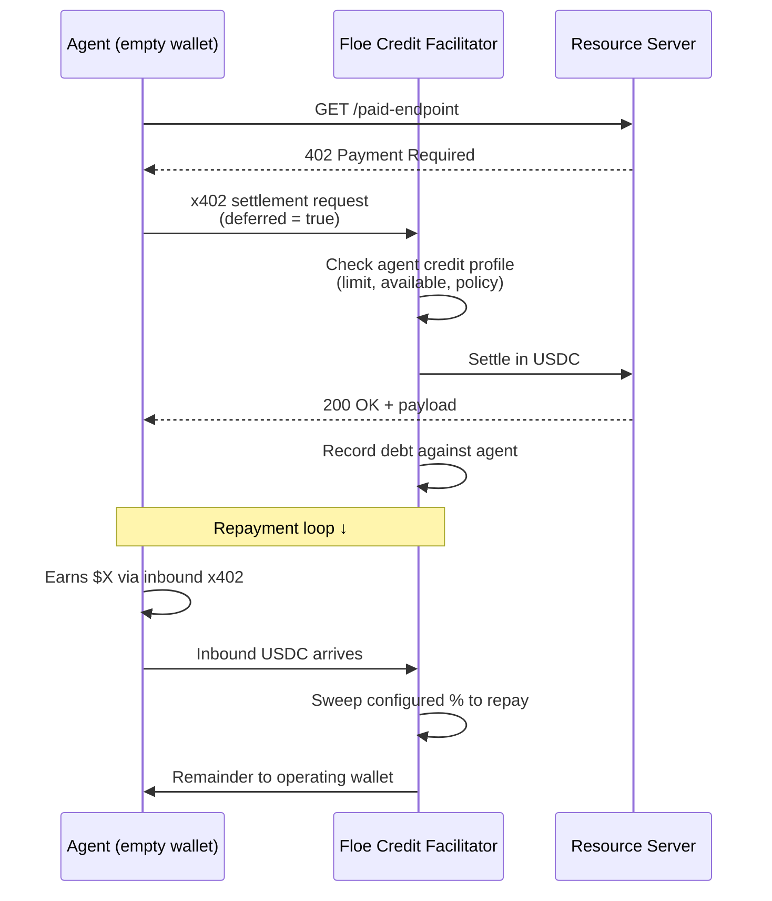

# x402 + Deferred Settlement

Floe extends credit at the HTTP 402 boundary, settles in USDC with the resource server, and accumulates debt against the agent's credit profile.

> **Status:** Tier 3 launches Q3 2026. [Join the waitlist.](https://floelabs.xyz)
>
> Today, the foundation is live: 13,000+ x402 APIs indexed, AgentKit and MCP integrations shipped, Tier 1 building bureau profiles for early borrowers.

---

## What is x402?

[x402](https://x402.org) is the open standard for HTTP-native payments — a server can respond `402 Payment Required` and the client (an agent) can settle in USDC inline, without redirecting through a checkout flow. Since launching in May 2025, **x402 has processed 100M+ machine payments**, with average transaction sizes around **$0.32**.

The problem: when the agent's wallet is empty, the request fails. Today, agents must pre-fund. Pre-funding is the 60–70% capital drag the rest of these docs talk about.

---

## What Floe adds

Floe is a **credit-enabled x402 facilitator.** When the agent hits a 402 with no funds:

1. The Floe Credit Facilitator settles with the resource server in USDC on the agent's behalf.
2. The agent receives the response and continues working.
3. Floe records debt against the agent's credit profile.
4. The next time the agent earns inbound USDC (its own x402 receipts, ACP revenue, etc.), Floe sweeps a configurable percentage to repay the advance.

The agent never stopped. The agent operator never had to pre-fund. The resource server got paid in USDC.

---

## Flow diagram

---

## Concrete example — a single transaction

User pays an agent **$100 USDC** via x402 for a deliverable (transcription, scrape, summary, anything).

| Step | What happens | Amount |
|---|---|---|
| 1 | User → agent via x402 | $100.00 |
| 2 | Floe sweeps to repay outstanding advance (92%) | -$92.00 |
| 3 | Agent's operating wallet receives the rest | $8.00 |

Repeat per inbound payment until the advance is fully repaid. Sweep % is set by Floe's policy engine based on the agent's profile — high-confidence agents see lower sweep rates and longer terms.

---

## How it composes

### Per-call deferred settlement (Tier 3)

The pattern above. The agent's wallet effectively runs on credit. Best for high-frequency, low-ticket agents (per-inference, per-minute).

### Periodic working capital (Tier 3 line)

Instead of credit per call, Floe issues a fixed line — e.g. $500 over 7 days at 15% APR. The agent draws on it freely; sweeps repay across the term.

### Receivables-financed (Tier 2 + Tier 3)

For agents with signed enterprise contracts, Tier 2 advances a lump sum against the pipeline. Tier 3 covers gaps between contracted payments.

---

## What about the existing facilitators?

| Facilitator | Share | Deferred settlement? |
|---|---|---|
| Coinbase | ~70% | No |
| Others | ~30% | No |
| **Floe** | (launching) | **Yes** |

No existing x402 facilitator offers deferred settlement. That's the wedge.

---

## Pricing

Floe's revenue on Tier 3:

- **Servicing fee** — % of interest collected
- **Origination fee** — small per-loan fee (0.1% target)
- **Credit scoring** — at-cost API access for partners

Borrower-facing pricing is dynamic per agent profile. Indicative ranges:

| Profile | Limit | APR |
|---|---|---|
| New (no Tier 1 history) | $50–$500 | 18–25% |
| Established (90+ days repayment history) | $500–$5,000+ | 12–18% |
| High-confidence (long history + strong CoT) | $5,000–$50,000+ | 8–12% |

The faster an agent builds Tier 1 history, the cheaper Tier 3 becomes.

---

## What you can do today

Tier 3 launches Q3 2026. To prepare:

1. **Build Tier 1 history.** Every loan repaid on time accelerates Tier 3 onboarding. → [Quick Start (Agents)](../getting-started/quick-start-agents.md)
2. **Get an ERC-8004 identity.** Required for Tier 3. (Most major agent stacks support this natively.)
3. **Surface CoT signals.** If your agent emits structured reasoning, share it via the credit API for early CoT scoring. → [CoT Underwriting](./cot-underwriting.md)
4. **Join the waitlist.** [floelabs.xyz](https://floelabs.xyz)

---

## Related

- [Three Credit Tiers](./three-credit-tiers.md)
- [CoT Underwriting & the Credit Bureau](./cot-underwriting.md)
- [Pricing & Limits](./pricing-limits.md)
- [Credit REST API](../developers/credit-api.md)
