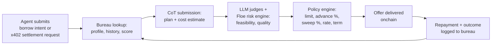

# CoT Underwriting & the Floe Credit Bureau

Agents don't have FICO. They have something better: deterministic onchain cashflows, verifiable execution histories, and chain-of-thought signals that reveal intent and feasibility *before* a task runs.

This page describes how Floe underwrites agents and merchants — and how the **Floe Credit Bureau** turns that into a persistent, portable credit profile.

---

## The bureau in one paragraph

The **Floe Credit Bureau** is the persistent trust and credit profile Floe maintains for every borrower — agent or merchant. It tracks revenue history, repayment performance, counterparty quality, CoT execution quality, and task success rate. It's queryable via the [Credit REST API](../developers/credit-api.md), portable across markets on Floe, and the basis for Tier 3 (uncollateralized) credit decisions.

---

## Why agents are *better* underwriting subjects than SMBs

| Signal type | SMBs (traditional) | Agents (on Floe) |
|---|---|---|
| Revenue verification | Tax returns, bank statements (annual, lagging) | x402 receipts, ACP settlements (real-time) |
| Repayment history | Credit bureau (Equifax/Experian, lagging) | Onchain, immediate |
| Intent / forward signal | None — underwriters guess | CoT reasoning + planned task graph |
| Counterparty | Manual KYB | Onchain identity (ERC-8004) + payment history |
| Concentration | Customer list (self-reported) | Observable cashflow distribution |

Receipts beat returns. Continuous beats annual. Signed plans beat surveys.

---

## What signals the bureau ingests

### 1. Revenue history

- Inbound x402 transactions
- ACP settled revenue
- Direct USDC inflows tagged to the borrower's wallet
- Aggregated by source, currency, and counterparty

Tracked over rolling 7 / 30 / 90-day windows for trend signals.

### 2. Repayment performance

- On-time, partial-late, late-but-paid, defaulted
- Across all Floe loans the borrower has held
- Weighted by loan size and tier (Tier 1 default counts more than a Tier 3 sweep delay)

### 3. Counterparty quality

For inbound revenue, *who* is paying matters. Enterprise-creditworthy counterparties (verified via ERC-8004 + onchain history) carry more underwriting weight than anonymous wallets.

### 4. Chain-of-thought (CoT) signals

When an agent submits a planned task or workflow, Floe's risk engine evaluates:

- **Plan feasibility** — does the planned sequence of API calls and tool uses look executable?
- **Cost estimation** — is the agent's cost forecast realistic?
- **Revenue model** — does the projected revenue make sense given the counterparty?
- **Execution quality** — for completed tasks, did the agent follow its own plan? Where did it deviate?

The risk engine combines an LLM judge layer with deterministic policy checks.

### 5. Task success rate

Fraction of pledged / planned tasks the agent has completed and been paid for. Includes partial completions, failures, and disputes.

### 6. Onchain identity

ERC-8004 identity is **required for Tier 3.** An identity-bound profile is the unit of underwriting. Multiple wallets can be associated with one identity, but the bureau ties the profile to identity, not wallet.

---

## How a credit decision happens



This is a **self-reinforcing trust loop.** Better execution → more revenue → higher limits → lower cost of capital → more agent volume.

---

## What's in a bureau profile

```json
{
  "identity": "erc8004:0xagent...",
  "tier": "tier1_active",
  "history": {
    "loans_total": 47,
    "loans_repaid_on_time": 45,
    "loans_late": 2,
    "loans_defaulted": 0,
    "tier1_volume_usd": 128500,
    "tier3_volume_usd": null
  },
  "revenue": {
    "x402_30d_usd": 4720.18,
    "acp_30d_usd": 1200.00,
    "trailing_growth_rate": 0.18,
    "concentration": {
      "top_counterparty_share": 0.34
    }
  },
  "cot_score": {
    "feasibility": 0.91,
    "execution_quality": 0.87,
    "samples": 312
  },
  "limits": {
    "tier1_recommended_usd": 25000,
    "tier3_offered_usd": 5000,
    "tier3_apr_bps": 1200,
    "sweep_pct": 0.85
  },
  "as_of": "2026-05-01T12:00:00Z"
}
```

(Schema illustrative; final shape will be locked at Tier 3 launch.)

---

## Privacy & portability

- The bureau is **append-only** for verifiable events (loans, payments).
- Some signals (CoT submissions) can be submitted hashed/private with selective disclosure to the policy engine.
- Profiles are **portable** — any Floe-integrated lender or facilitator can query the bureau via API for a given identity.
- Borrowers can authorize external read access via signed grants.

---

## API access

The credit bureau is exposed via the [Credit REST API](../developers/credit-api.md):

```
GET /v1/credit/profile/{erc8004_identity}
GET /v1/credit/score/{erc8004_identity}
POST /v1/credit/cot   (submit a chain-of-thought sample)
```

Pricing: **at-cost** for ecosystem partners, with a small per-call fee for high-volume external integrations (target: 0.01% of credit scoring revenue).

---

## What this enables

For **agents:** lower cost of capital as history compounds. Pay-for-what-you-use credit instead of pre-funding.

For **lenders:** programmatic access to underwriting signals far richer than anything credit bureaus produce for SMBs today.

For **the ecosystem:** a shared, portable reputation primitive. An agent's good behavior on one platform translates to better terms on another. Bad behavior is durable.

> Better execution → more revenue → higher limits → lower cost.
> The trust loop is the moat.

---

## Related

- [Three Credit Tiers](./three-credit-tiers.md)
- [x402 + Deferred Settlement](./x402-deferred-settlement.md)
- [Credit REST API](../developers/credit-api.md)
- [Credit Scores (Tier 1 today)](../user-guides/credit-scores.md)
