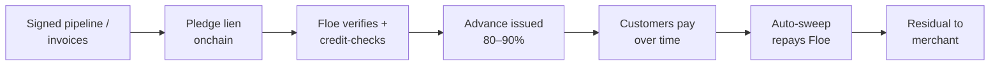

# Receivables Financing — Overview

> **Status:** Launching Q3 2026. $2M MRR signed under LOIs. [Join the waitlist.](https://floelabs.xyz)

Programmable trade finance for merchants and SMBs. Get paid now on signed pipeline that doesn't settle for 30, 60, or 90 days.

---

## The problem

Merchants and SMBs across every sector — voice agent platforms, browser agent platforms, traditional services — have the same cashflow problem:

- 30–90 day payment terms
- Invoices live in email, PDFs, and ERPs
- No real-time visibility into pipeline status
- Offline, opaque, slow factoring as the only alternative
- Trapped working capital

Result: merchants front the bill. They grow slower. They discount more. Billions in liquidity sit idle in receivables waiting to settle.

---

## The Floe approach

The same primitive that powers agent credit also powers receivables financing: a **lien recorded onchain on a deterministic future cashflow**, advanced upfront, repaid by automatic sweep.

### Steps

1. **Pledge.** Merchant pledges a lien on signed invoices / pipeline. Recorded onchain.
2. **Verify & value.** Floe verifies invoices, ages them, checks counterparty creditworthiness and payment history.
3. **Advance.** Capital advanced to merchant — typically 80–90% of receivable face value. Daily or weekly disbursement.
4. **Repay.** As customers pay (daily / weekly), inbound USDC is automatically swept to repay the advance until balance is zero. Residual flows to the merchant.

---

## Concrete example

Merchant has **$50,000 in NET-60 invoices** from enterprise customers.

| Step | What happens | Amount |
|---|---|---|
| 1 | Merchant pledges invoices | $50,000 face value |
| 2 | Floe advances 85% | $42,500 to merchant wallet |
| 3 | Customers pay daily/weekly | Inbound to merchant wallet |
| 4 | Floe sweeps until repaid | -$42,500 + interest |
| 5 | Residual flows to merchant | balance |

---

## Comparison

| Traditional factoring | Floe receivables |
|---|---|
| 30–90 day approval | Same-day onchain |
| Offline, opaque | Real-time, transparent |
| Invoices in PDFs, email, ERP | Onchain pledged + verified |
| Credit-desk relationship required | Permissionless onboarding |
| Fixed % discount | Dynamic pricing per receivable |
| Recourse / personal guarantees | Per-pledge isolated |

---

## Status as of launch

- **$2M MRR signed under LOIs** with 2 partners
- 30% net IRR for liquidity providers
- Daily remittance
- Wilmington Trust-backed structure
- $1B/year projected dealflow at scale

---

## What launches Q3

- Onboarding flow (merchant pledge UI)
- Invoice & counterparty verification pipeline
- Sweep contracts on Base mainnet
- Liquidity provider portal (institutional + permissioned pools)
- Credit Bureau integration for merchant scoring (parallel to agent bureau)

---

## Pricing

| Pricing component | Direction |
|---|---|
| Advance % | 80–90% of pledged face value |
| Discount rate (effective APR) | Equivalent to ~25–35% IRR for lenders |
| Term | Typically aligned with invoice maturity (30–90 days) |
| Origination | Small per-pledge fee (~0.1%) |

Final pricing is set at the per-pledge level by Floe's policy engine, factoring counterparty credit, aging, concentration, and merchant history.

---

## Frequently asked

**Who can pledge?**
Any merchant with onchain payment receipt for invoices, or an integrated receivables source (we'll publish supported sources at launch).

**Do customers need to pay in USDC?**
USDC inflow is the simplest case. Other settlement currencies will be supported via on-ramp partners — under design.

**What if a customer doesn't pay?**
Pricing accounts for default risk. The advance % is set conservatively per counterparty. Persistent merchant defaults affect future pricing through the bureau.

**Is this regulated?**
Tokenization structure under legal review. Wilmington Trust-backed, tokenization WIP. Institutional onboarding follows standard KYC/KYB procedures.

---

## Related

- [The Three Credit Tiers](../agents/three-credit-tiers.md)
- [Institutions Overview](../institutions/overview.md) — the LP side of receivables
- [Roadmap](../reference/roadmap.md)

---

*Want to be among the first merchants on Tier 2? Email [hello@floelabs.xyz](mailto:hello@floelabs.xyz) or [join the waitlist.](https://floelabs.xyz)*
